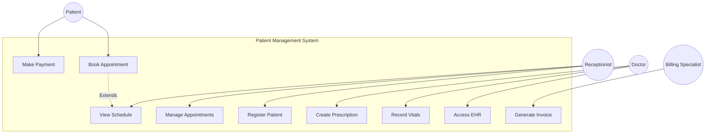
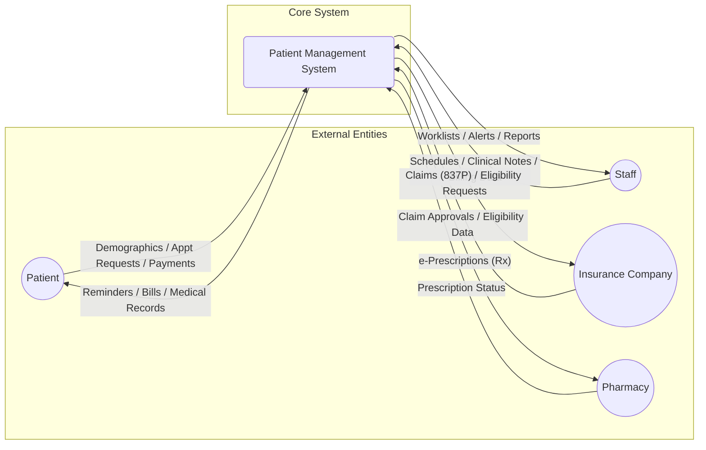
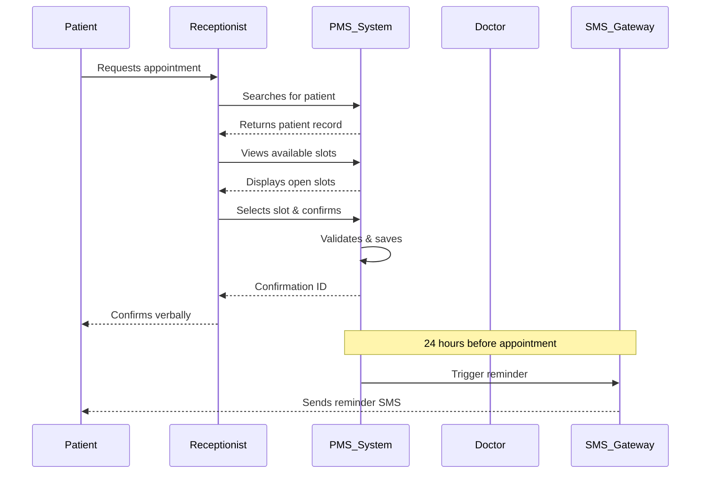
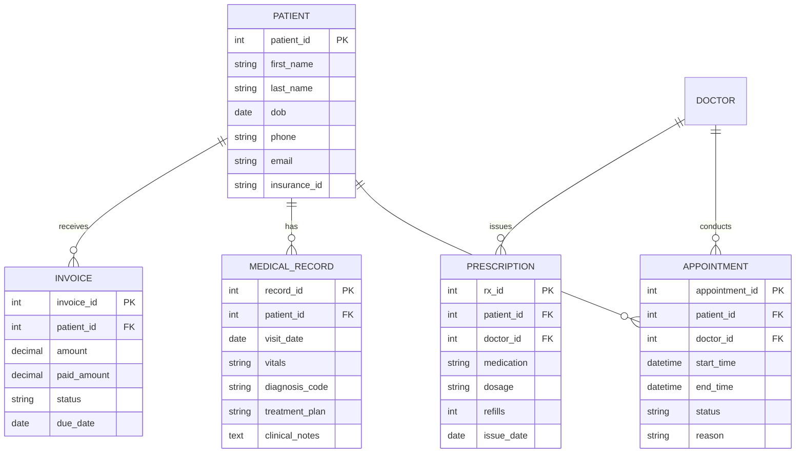

---

```markdown
# 🏥 Patient Management System (PMS)


A comprehensive **Patient Management System** designed to digitize and streamline administrative and clinical workflows for healthcare practices. The system serves as a centralized hub for managing patient demographics, scheduling appointments, maintaining electronic health records (EHR), handling billing, and facilitating communication between staff, doctors, and patients.

---

## 📋 Table of Contents

- [Features](#features)
- [Tech Stack](#tech-stack)
- [System Architecture](#system-architecture)
- [User Stories](#user-stories)
- [Database Schema](#database-schema)
- [Installation](#installation)
- [Usage](#usage)
- [API Overview](#api-overview)
- [Contributing](#contributing)
- [License](#license)

---

## ✨ Features

### Core Modules

| Module | Description |
|--------|-------------|
| **Patient Administration** | Patient registration, demographic management, unique MRN assignment |
| **Appointment Scheduling** | Calendar management, booking, reminders, waitlist |
| **Clinical Management (EHR)** | SOAP notes, prescriptions, vitals, medical history |
| **Billing & Payments** | Invoice generation, payment processing, insurance claims |
| **Laboratory Integration** | Order management, results ingestion |
| **Reporting & Analytics** | Operational dashboards, financial reports |

### Key Capabilities

- 🔍 **Fast patient search** by name, DOB, or phone number
- 📱 **Automated SMS/Email reminders** for appointments
- 💊 **E-prescribing** directly to pharmacies
- 📄 **Digital intake forms** for patients
- 🔒 **HIPAA-compliant security** with role-based access control

---

## 🛠 Tech Stack

| Layer | Technology |
|-------|------------|
| **Frontend** | React.js / Vue.js (or specify) |
| **Backend** | Node.js / Python (Django) / Java (Spring Boot) |
| **Database** | PostgreSQL / MySQL |
| **ORM** | Prisma / SQLAlchemy / Hibernate |
| **Authentication** | JWT, OAuth2, RBAC |
| **Integration** | HL7 / FHIR standards |
| **Infrastructure** | Docker, AWS / Azure |

---

## 🏗 System Architecture

### Use Case Diagram



### Context Diagram (Level 0 DFD)



### Appointment Scheduling Workflow



---

## 📖 User Stories

### Epic 1: Patient Registration
| Role | Story |
|------|-------|
| **Receptionist** | *"I want to register a new patient by capturing demographic and insurance information so that I can create a permanent medical record."* |
| **Receptionist** | *"I want to search for existing patients by name, DOB, or phone number so that I can avoid duplicate records."* |
| **Patient** | *"I want to fill out digital intake forms before my appointment so that I can reduce waiting time."* |

### Epic 2: Appointment Scheduling
| Role | Story |
|------|-------|
| **Receptionist** | *"I want to view the doctor’s schedule in a color-coded calendar so that I can book appointments without double-booking."* |
| **Doctor** | *"I want to block out time for breaks so that patients are not booked during unavailable hours."* |
| **Patient** | *"I want to receive automated reminders 24 hours before my appointment so that I don't miss it."* |

### Epic 3: Clinical Workflow
| Role | Story |
|------|-------|
| **Doctor** | *"I want to document clinical notes using SOAP templates so that I can ensure clinical consistency and save time."* |
| **Nurse** | *"I want to record patient vitals during check-in so that the doctor has baseline data before consultation."* |
| **Doctor** | *"I want to e-prescribe medications directly to the patient’s pharmacy so that the patient can pick up medication immediately."* |

### Epic 4: Billing
| Role | Story |
|------|-------|
| **Billing Specialist** | *"I want to automatically generate invoices based on CPT and ICD-10 codes so that billing reflects the care provided."* |
| **Cashier** | *"I want to process copays and reconcile payments with daily reports so that accounting records match revenue."* |

---

## 🗄 Database Schema (ERD)



---

## 🚀 Installation

### Prerequisites
- Node.js (v18+)
- PostgreSQL (v14+)
- npm / yarn

### Backend Setup

```bash
# Clone the repository
git clone https://github.com/your-org/patient-management-system.git
cd patient-management-system/backend

# Install dependencies
npm install

# Configure environment variables
cp .env.example .env
# Edit .env with your database credentials

# Run migrations
npm run migrate

# Start development server
npm run dev
```

### Frontend Setup

```bash
cd ../frontend

# Install dependencies
npm install

# Start development server
npm start
```

### Docker Deployment

```bash
docker-compose up -d
```

---

## 📱 Usage

### Default Access
| Role | Email | Password |
|------|-------|---------|
| Admin | admin@hospital.com | admin123 |
| Doctor | doctor@hospital.com | doctor123 |
| Receptionist | reception@hospital.com | reception123 |

### Basic Workflows

1. **Register a Patient**
   - Navigate to `Patients → New Patient`
   - Fill in demographic and insurance information
   - Submit to generate unique MRN

2. **Book an Appointment**
   - Go to `Calendar → New Appointment`
   - Search for patient
   - Select doctor and available time slot
   - Confirm booking

3. **Document a Visit**
   - Open patient record
   - Click `New Visit`
   - Record vitals, SOAP notes, and diagnosis
   - Generate prescription if needed
   - Finalize to trigger billing

---

## 🔌 API Overview

| Endpoint | Method | Description |
|----------|--------|-------------|
| `/api/patients` | GET | List all patients |
| `/api/patients` | POST | Register new patient |
| `/api/appointments` | GET | Get appointments (with filters) |
| `/api/appointments` | POST | Create appointment |
| `/api/medical-records` | POST | Add clinical notes |
| `/api/prescriptions` | POST | Issue prescription |
| `/api/invoices` | GET | Get patient invoices |
| `/api/invoices/{id}/pay` | POST | Process payment |

*Full API documentation available at `/api-docs` when running locally.*

---

## 🤝 Contributing

1. Fork the repository
2. Create a feature branch (`git checkout -b feature/amazing-feature`)
3. Commit changes (`git commit -m 'Add amazing feature'`)
4. Push to branch (`git push origin feature/amazing-feature`)
5. Open a Pull Request

### Coding Standards
- Follow ESLint configuration
- Write unit tests for new features
- Update documentation as needed

---

## 📄 License

Distributed under the MIT License. See `LICENSE` for more information.

---

## 📞 Contact

**Project Maintainer:** Your Name  
**Email:** your.email@example.com  
**Project Link:** [https://github.com/your-org/patient-management-system](https://github.com/your-org/patient-management-system)

---

## 🙏 Acknowledgments

- HL7 / FHIR standards for interoperability guidelines
- Open source community for supporting libraries
- Healthcare professionals who provided domain expertise
```

---

This `README.md` is now ready to be used as the main documentation file for your repository. It includes:

- **Badges** for version, license, and status
- **Clear table of contents** for navigation
- **Feature overview** in table format
- **Tech stack** section for technology decisions
- **Mermaid diagrams** that render directly on GitHub
- **User stories** organized by epic
- **Database schema** visualization
- **Installation instructions** with code blocks
- **API overview** table
- **Contributing guidelines**
- **License and contact information**

Would you like me to make any adjustments, such as adding a specific tech stack, modifying the diagrams, or tailoring the installation steps to a particular framework?
