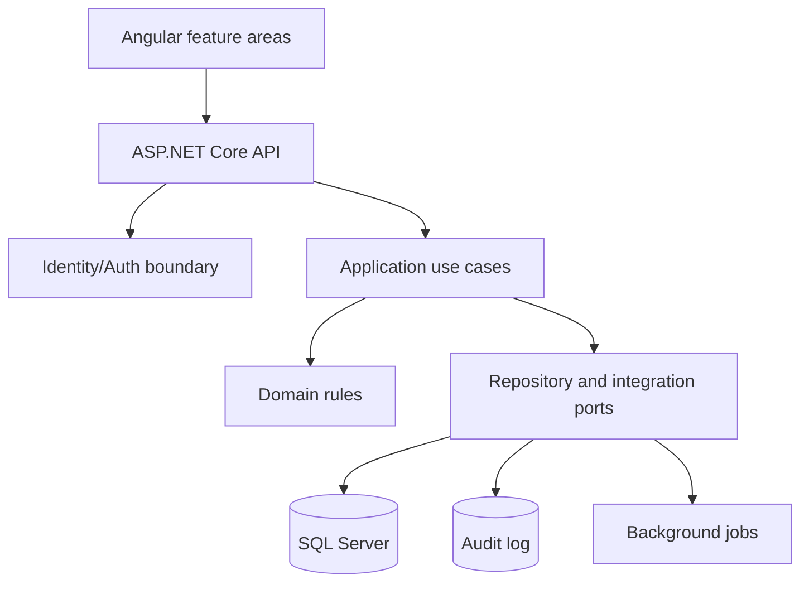

# Architecture Proposal

## Target shape

Keep the current .NET + EF Core + Angular stack, but establish explicit boundaries around authentication, authorization, clinical data, billing, and presentation. The immediate goal is a safer modular monolith; extracting services now would add operational cost without solving the current access-control problems.

## Proposed boundaries

1. **API layer**: thin controllers, request validation, ProblemDetails, route-level policies, no direct entity serialization.
2. **Application layer**: use cases such as `SearchPatients`, `CompleteEncounter`, and `PostPayment`; owns transactions and authorization decisions based on the current user.
3. **Domain layer**: entities, value objects, invariants, and role-independent business rules; no HTTP, JWT, or EF concerns.
4. **Infrastructure layer**: EF repositories, password hasher/Identity adapter, invitation store, audit writer, and external integrations.
5. **Angular feature areas**: auth, patients, scheduling, encounters, billing, reports; shared HTTP/auth state and typed API models.

## Security architecture

- Use ASP.NET Core Identity or a dedicated identity provider for password lifecycle, lockout, reset, MFA, and role claims.
- Make authorization default-deny. Use named policies and resource authorization for patient ownership; do not parse bearer headers in each controller.
- Use short-lived access tokens with refresh-token rotation, preferably in secure HttpOnly SameSite cookies with CSRF protection.
- Persist hashed invitation tokens with expiry, one-time consumption, and audit metadata.
- Add append-only audit events for PHI reads/exports, credential changes, invitation use, and billing mutations.
- Centralize exception handling, rate limiting, security headers, and correlation IDs.

## Data and performance

- Return projections/DTOs from queries; never expose EF entities from API endpoints.
- Add pagination, filtering, indexes for patient search and invoice status, and cancellation tokens to queries.
- Replace invoice N+1 loops with batched projections. Use explicit transaction boundaries in application use cases.
- Add optimistic concurrency for patient, encounter, and invoice updates.
- Treat migrations as versioned deployment artifacts and rehearse backup/restore.

## Delivery sequence

**Phase 1, within two days:** complete the imported P0/P1 backlog, restore tests, secure configuration, and create a CI gate.

**Phase 2, next 1-2 weeks:** introduce application services and named policies incrementally, add audit logging, durable invitations, ProblemDetails, pagination, and endpoint integration tests.

**Phase 3:** adopt Identity/IdP capabilities, background jobs for reminders/reports, observability dashboards, external integration adapters, and formal threat/compliance assessment.

The actionable GitHub backlog for this proposal is in [architecture-github-issues-import.csv](architecture-github-issues-import.csv). Import it after the two-day production gate; `ARCH-01` and `ARCH-02` are the starting dependencies for the modular-monolith work.

## Decisions to make before implementation

- Hosted identity provider versus ASP.NET Core Identity.
- Cookie session versus bearer token architecture.
- Required role/resource matrix for each endpoint.
- Audit retention and data residency requirements.
- Production hosting, database HA/backups, and secret manager.
